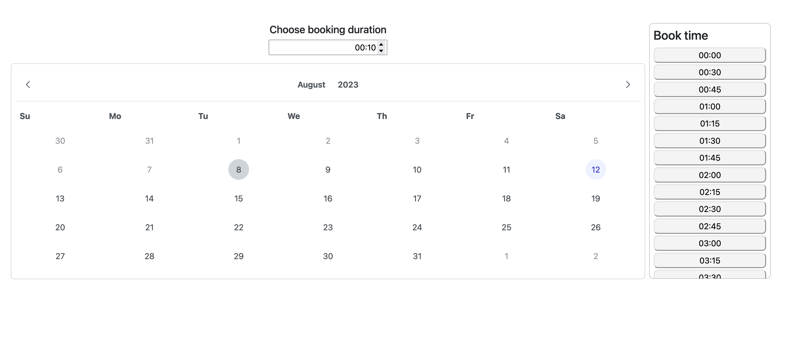

# Bookings

## Intallation
- Install ruby `3.0.2`
- Install Node.js and yarn
- Run `bundle`
- Run `yarn`
- Run `bundle exec rails db:create`
- Run `bundle exec rails db:migrate`
- Run `bundle exec rails db:seed`

### Starting the server

`bin/dev`

### Running tests

`bundle exec rspec spec`
